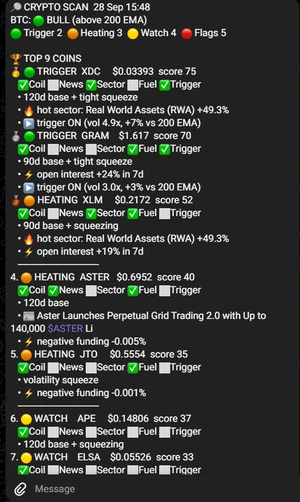
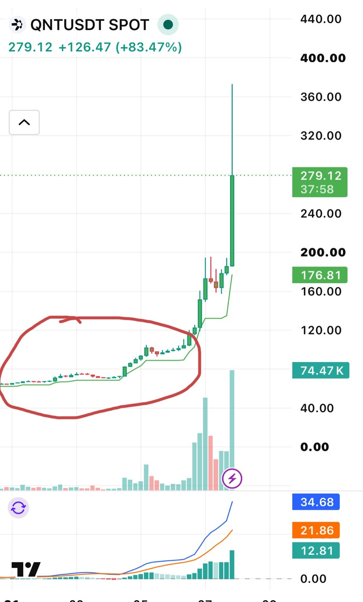
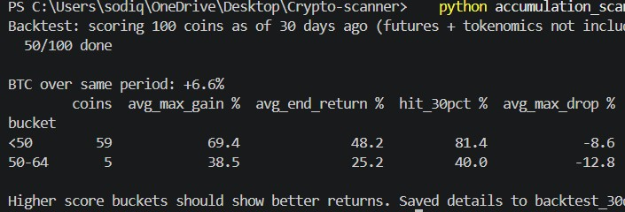
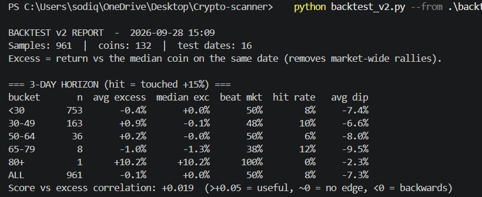
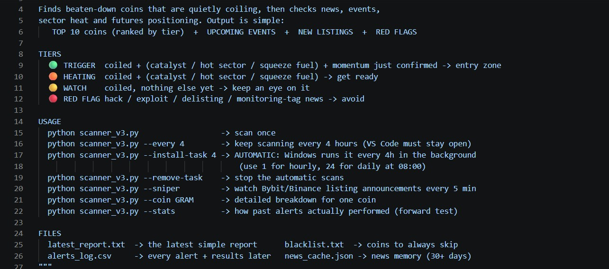

# Crypto Accumulation Scanner

A Python tool that scans the crypto market for coins quietly "coiling" in a long, flat base before a breakout, then checks news, sector momentum and futures positioning, and sends a ranked shortlist to Telegram every 4 hours.

The more important part of this project is the testing. Version 1 looked right but had almost no predictive power once I backtested it properly, so I rebuilt it around what the data actually showed.



---

## The idea

Big breakouts often start from a long period of low volatility: price goes flat, volatility shrinks, and nobody pays attention. By the time a coin is up 80% in a day, the opportunity was weeks earlier.



**Question:** can a script find that quiet phase across hundreds of coins, before the move?

---

## How it evolved

| Version | What it did | What I learned |
|---|---|---|
| **v1** | Scored ~218 Bybit coins on base, volume, trend and MACD; saved CSV and sent Telegram alerts | It ran, and the top picks looked right on the chart. But "looks right" isn't evidence |
| **v2** | 13 factors (OBV, 200 EMA, volatility squeeze, relative strength vs BTC, funding and open interest, and more) plus a first backtest | The first backtest was **flawed by survivorship bias**: it picked coins that were liquid *today*, and 81% of all coins pumped that month |
| **Backtest v2** | Rolling test across 16 weekly dates, point-in-time liquidity filter, returns measured **vs the median coin** on the same date | The score had **almost no edge** (correlation 0.02–0.10). Most "smart" momentum signals hurt |
| **v3** | Rebuilt around the evidence: coil = score, momentum = entry timing only, plus free news feeds for catalysts, events and red flags | Now forward-testing live, with every alert logged and checked 3, 7 and 14 days later |



---

## What the data said (backtest v2: 961 samples, 132 coins, 16 weeks)



Extra 14-day return when each signal was present vs absent:

| Signal | Lift |
|---|---|
| Beaten down + hasn't moved yet (filters) | **+7.1%** |
| Long, tight price base | +2.1% |
| Volatility squeeze | +1.0% |
| Trend flip | −0.9% |
| Volume waking up | −1.3% |
| Buy-volume dominance | −2.2% |
| OBV accumulation | −3.0% |
| Strength vs Bitcoin | −3.2% |

**Interpretation:** momentum signals tend to fire *after* a move has started. The edge, where there is one, sits in the quiet coil before it. Big pumps (+50% in 14 days) were largely not predictable from price data alone, which is why v3 adds news and event detection.

> Caveat: one 16-week period and small lifts. Only the filter effect is large enough to treat as more than noise. That's why v3 includes a forward-test logger.

---

## v3: how it works



**Two pipelines, 100% free data (no paid APIs):**

1. **Market data** (Bybit public API via `ccxt`): filters → coil score → futures fuel → momentum trigger
2. **News** (public RSS feeds + Bybit/Binance announcements): keyword scoring → catalysts, upcoming events, red flags

**Tiers**

| Tier | Meaning |
|---|---|
| 🟢 TRIGGER | Coiled + (catalyst / hot sector / squeeze fuel) + momentum just confirmed |
| 🟠 HEATING | Coiled + (catalyst / hot sector / squeeze fuel) |
| 🟡 WATCH | Coiled, nothing else yet |
| 🔴 RED FLAG | Hack / exploit / delisting news near the coin's name: skipped |

Red flags use a **proximity rule**: the risk word must appear close to the coin's name, and "bystander" phrasing (e.g. *hacker swaps ETH*) is ignored. This removed false flags on ETH, XRP and LINK during testing.

---

## Setup

```bash
git clone https://github.com/sodiqoluwatimileyin190-oss/crypto-accumulation-scanner.git
cd crypto-accumulation-scanner
pip install -r requirements.txt
```

**Telegram (optional):** copy `config.example.json` to `config.json` and add your bot token (from @BotFather) and chat ID. `config.json` is git-ignored, so it never gets uploaded.

## Usage

```bash
python scanner_v3.py                    # scan once
python scanner_v3.py --coin GRAM        # breakdown for one coin
python scanner_v3.py --install-task 4   # Windows: run automatically every 4h
python scanner_v3.py --runs             # log of every scan (date, time, OK/FAILED)
python scanner_v3.py --stats            # forward-test results of past alerts
python scanner_v3.py --sniper           # listing announcements every 5 min

python backtest_v2.py                   # rolling backtest (15-30 min)
python backtest_v2.py --from backtest_v2_XXXX.csv   # rebuild report from saved data
```

## Project structure

```
scanner_v3.py              main scanner (tiers, news, events, alerts, automation)
backtest_v2.py             rolling, bias-reduced backtest with factor report
accumulation_scanner_v2.py 13-factor scanner (used by the backtest)
blacklist.txt              coins to always skip
config.example.json        template for Telegram credentials
project-carousel.pdf       visual walkthrough of the project
```

---

## Lessons

- A backtest that proves you wrong is worth more than a strategy that just looks good.
- Check the test for bias before trusting the result.
- Simple, evidence-backed signals beat 13 clever ones.
- Save raw data first, so a crash never costs the whole run.
- AI was my coding partner; the idea, testing decisions and judgment calls were mine.

## Tech

Python · pandas · NumPy · ccxt (Bybit REST API) · RSS/XML parsing · CoinGecko API · Telegram Bot API · Windows Task Scheduler

## Disclaimer

Educational and research project. **Not financial advice.** The scanner produces a watchlist, not trade signals. Its edge is unproven until the forward test says otherwise.

---

**Author:** Sodiq Basit Oluwatimileyin, Data Analyst
